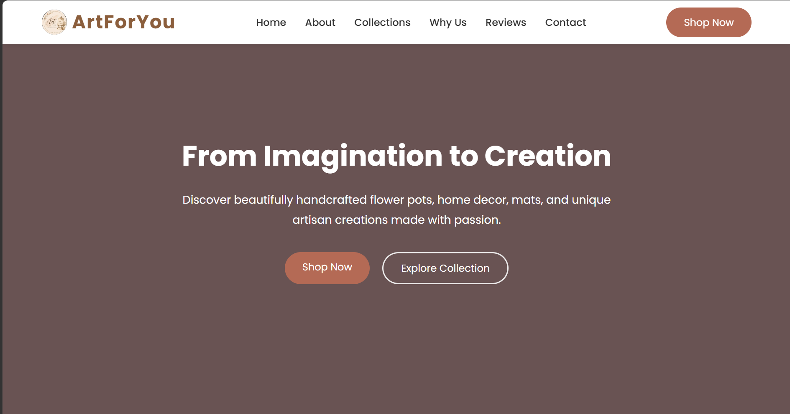

# 🎨 ArtForYou Handmade Crafts Store

A modern and responsive Handmade Crafts Store Landing Page built using HTML and CSS as part of the CodSoft Web Development Internship – Level 1 Task 2.

---

## 📸 Preview

  

---

## 📖 Project Overview

This project is a visually appealing handmade crafts store landing page created for ArtForYou. It showcases unique handcrafted products including painted flower pots, cement planters, handmade mats, and home decor items.

The website features a clean and modern layout, smooth navigation, attractive product sections, customer reviews, and a responsive design that works across different devices.

---

## ✨ Features

- 🏠 Hero Section with Call-to-Action Buttons
- 📖 About Us Section
- 🎨 Handmade Collections
- 🌸 Painted Flower Pots
- 🪴 Cement Planters
- 🧶 Handmade Mats
- 🏡 Home Decor
- 🌿 Why Choose Us Section
- ⭐ Customer Reviews
- 📞 Contact Section
- 📱 Fully Responsive Design
- ✨ Smooth Scrolling Navigation
- 🎨 Modern UI & Hover Effects
- 📱 Social Media Links

---

## 🛠️ Technologies Used

- HTML5
- CSS3

---

## 🚀 Live Demo

🔗 https://meghanasoma02.github.io/codsoft_tasks/Landing_Page/

---

## 👩‍💻 Author

**Sindhuja Soma**

- GitHub: https://github.com/meghanasoma02
- LinkedIn: https://www.linkedin.com/in/meghana-soma-655048357

---

⭐ If you like this project, feel free to give it a ⭐ on GitHub.
